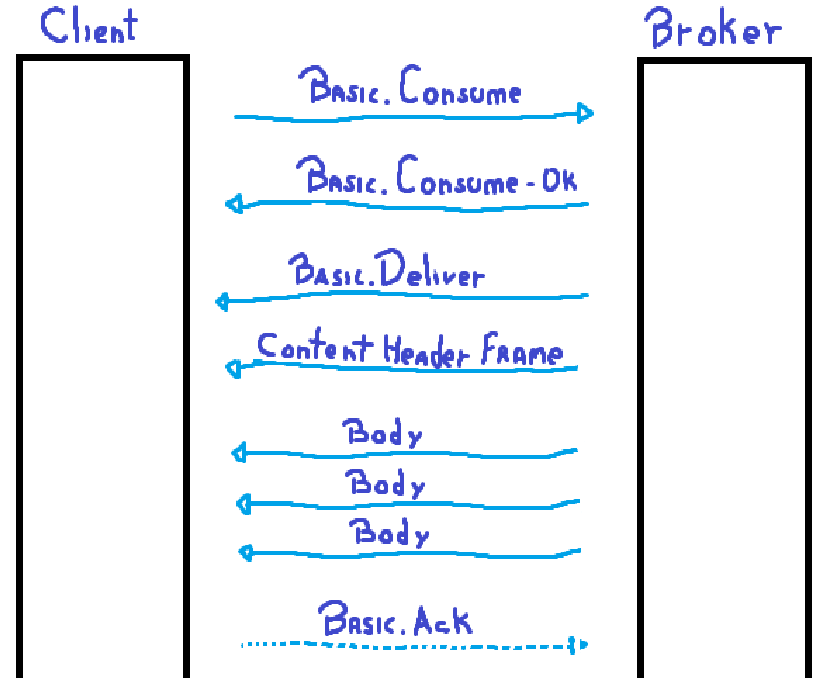

**AMQP for RabbitMQ**

**Advanced Message Queuing Protocol (AMQP)** is an open standard that enables reliable message exchange between
applications and organizations. It operates using a message-oriented middleware (MOM) pattern, facilitating asynchronous
communication between clients (producers and consumers) and the message broker (RabbitMQ in this context). Clients can
send messages (publish) and receive messages (consume) through the broker, ensuring decoupling and improved scalability.

**AMQP Frames**

Messages in AMQP are transmitted as a sequence of frames, each with a specific purpose:

- **Method Frame:** Initiates an action with the broker (e.g., declare a queue, publish a message).
- **Content Header Frame:** Carries message properties like size and number of body frames.
- **Body Frame(s):** Contains the actual message payload.
- **Heartbeat Frame:** Maintains connection health checks by periodically sending empty frames from both client and
  broker.

**Frame Structure**

Every frame adheres to a standardized format:

| Field Name             | Size (Bytes) | Description                                                  |
|------------------------|--------------|--------------------------------------------------------------|
| Frame Type             | 1            | Identifies the frame type (e.g., method, content header).    |
| Channel                | 2            | Specifies the communication channel (multiplexing).          |
| Size                   | 4            | Indicates the total frame size excluding the frame end byte. |
| Frame Specific Content | Variable     | Varies depending on the frame type (method arguments, etc.). |
| Frame End              | 1            | Denotes the frame's termination.                             |

**Method Frame Details**

The method frame is crucial, specifying the desired action with the broker. It includes:

- **Class (4 bytes):** Identifies the class of operation (e.g., exchange, queue).
- **Method (2 bytes):** Denotes the specific method within the class (e.g., declare, publish).
- **Arguments:** Additional data required for the chosen method, as defined in the AMQP
  specification ([https://www.rabbitmq.com/docs/protocols](https://www.rabbitmq.com/docs/protocols)).

**Message Transmission**

Sending or receiving messages involves a specific frame sequence:

1. **Method Frame:** Initiates the message operation (e.g., `basic.publish` for sending).
2. **Content Header Frame:** Provides message properties.
3. **Body Frame(s):** Delivers the message content.

**Additional Notes:**

- The AMQP specification ([https://www.rabbitmq.com/docs/protocols](https://www.rabbitmq.com/docs/protocols)) offers
  comprehensive information on frame formats, methods, and arguments.
- This summary focuses on AMQP 0-9-1, the primary protocol used by RabbitMQ.

**Client-Broker Communication**

The client initiates communication with the broker by sending a protocol header. This header identifies the AMQP
protocol version (major, minor, and revision) the client supports. The broker validates the header and responds
accordingly:

- **Acceptance:**
    - The broker sends a "connection.start" method frame proposing supported protocol versions, security mechanisms for
      authentication, and server properties.
    - The client selects an authentication mechanism (e.g., SASL) and responds with a "connection.start-ok" method
      frame.
- **Rejection:**
    - The broker sends a valid protocol header and closes the connection (typically due to version mismatch or
      unsupported features).

**Authentication (if applicable):**

The chosen authentication mechanism, such as SASL, typically involves an exchange of challenges and responses to
establish mutual trust. This handshake usually consists of:

- **Server Challenge:** The broker sends a "connection.secure" method frame challenging the client for authentication
  details.
- **Client Response:** The client responds with a "connection.secure-ok" method frame containing SASL data for
  authentication.

**Connection Tuning:**

Once authenticated, the broker sends a "connection.tune" method frame specifying its capabilities, including:

- Maximum supported channels
- Maximum frame size
- Preferred heartbeat delay

The client responds with a "connection.tune-ok" method frame confirming the agreed-upon connection parameters (channels,
frame size, and heartbeat).

**Connection Establishment:**

Finally, the client sends a "connection.open" method frame to initiate the connection. The broker responds with a "
connection.open-ok" method frame, indicating a successful connection ready for message exchange.

**Declaring a Queue**

The client sends a `queue.declare` method frame specifying the queue name and optional arguments (e.g., durability,
exclusivity). If successful, the server responds with a `queue.declare-ok` frame. If there's an error, RabbitMQ
automatically closes the channel.

**Publishing a Message**

This section outlines the steps involved in sending a message to RabbitMQ:

1. **Method Frame:** The client initiates the process with a `basic.publish` method frame, indicating the intention to
   publish a message.
2. **Content Header Frame:** Next, the message properties like size and number of body frames are sent in the content
   header frame.
3. **Body Frame(s):** Finally, the message content itself is delivered in one or more body frames, depending on the
   message size and RabbitMQ's limitations.

**Receiving a Message**

This section details two approaches for receiving messages from RabbitMQ:

**Using the `basic.get` Method**

- This method provides direct access to messages in RabbitMQ, suitable for specific applications prioritizing
  synchronous functionality over performance.
- The client initiates with a `basic.get` method frame, and the broker responds with either `basic.get-empty` (no
  message in queue) or `basic.get-ok` (message available).
- If a message is present, the content header and body frames follow, and the client acknowledges receipt with
  a `basic.ack` method frame.
- This process repeats for retrieving additional messages.

**Using a Consumer**

- This is the preferred method for receiving messages due to efficiency.
- The client sends a `basic.consume` method frame, requesting the broker to start a consumer for a specific queue.
- The broker responds with a `basic.consume-ok` frame.
- When a message arrives, the broker sends a `basic.deliver` frame to the client, followed by the content header and
  body frames.
- The client confirms receipt with a `basic.ack` frame.
- This loop continues until the client closes the consumer or the channel.

