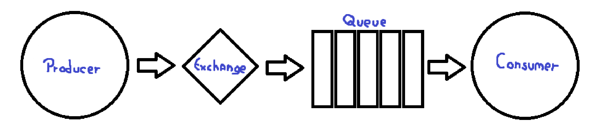
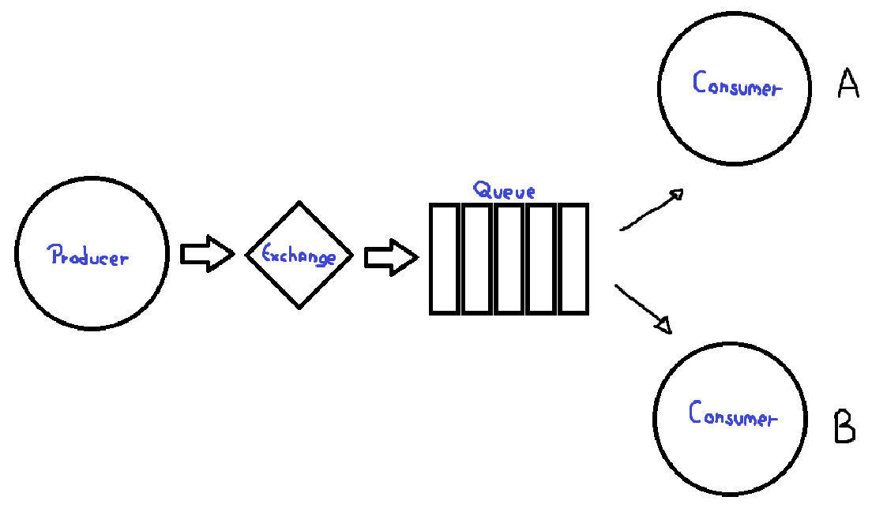

# Competição de Consumidores

O modelo que abordamos até agora, semelhante ao ilustrado na imagem acima, apresenta um potencial gargalo. Se o
produtor gerar mensagens mais rapidamente do que o consumidor consegue consumi-las, a fila, mesmo extensa, não impedirá
o
acúmulo de mensagens. Como a produção supera o consumo, a quantidade de mensagens na fila tende ao infinito, o que, por
sua vez, aumenta ilimitadamente o tamanho da fila e a demanda por memória do sistema. Uma solução possível para este
problema é adicionar outro consumidor como é possível observar na imagem abaixo.

No caso de existirem dois consumidores, caso ambos demorem o mesmo tempo para consumir as mensagens, não haverá
problema,
porém, em muitos casos, cada um demora uma quantidade de tempo diferente do outro para realizar este processamento,
dessa forma, o Sistema não poderá ficar "revesando" os consumidores, pois caso haja uma diferença considerável de tempo
para realizar o processamento do sinal, o sistema ficará congelado, até que o consumidor mais lento termine sua tarefa.

Este problema, acontece porque o RabbitMQ, ao enviar uma mensagem, não olha a quantidade de mensagens designada pra cada
consumidor.
Para resolver isso, é possível definir o valor do prefetch como 1, que fará com que o RabbitMQ coloque mais do que uma
mensagem na fila para cada consumidor.

De uma forma geral, adicionar mais consumidores é uma forma de resolver o problema, deixando o Sistema mais escalável e
confiável. Escalável pois é possível colocar quantos consumidores forem necessários, coisa que poderá possibilitar o
sistema de ser mais rápido e o sistema também ficará mais confiável, pois, caso um dos consumidores seja desativado por
um motivo qualquer, ainda haverão outros. Porém, ter vários consumidores, fará com que o sistema seja computacionalmente
mais complexo, dessa forma, talvez deixando o processo mais lento, devido ao alto uso de CPU para manter os vários
consumidores funcionando.

* Caso qualquer tipo de perda de mensagem seja extremamente crítico, é melhor um sistema mais lento com vários
  consumidores, do que um sistema com menos consumidores onde haverá estouro de pilha e uma ou várias mensagens serão
  perdidas. 

