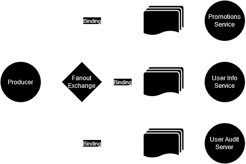

# Pub/Sub

O padrão Pub/Sub, diferente do padrão de multiplos consumidores, persiste em enviar a mesma mensagem, para múltipos
consumidores, sendo assim diferente do padrão de multiplos consumidores, cujo o objetivo é consumir a maior quantidade
de mensagens no menor tempo possível. A principal aplicação deste padrão ocorre em aplicações que a mesma mensagem
deverá ser processada de duas formas diferentes ao mesmo tempo.

* Exemplo: um usuário acabou de se registrar em um sistema, dessa forma, será publicada uma mensagem de "nova conta
  criada", e vários microserviços menores podem estar interessadas nessa mensagem como por exemplo um micro serviço
  responsável por armazenar um usuário ao mesmo tempo que outro micro serviço é responsável por garantir os privilégios
  a este mesmo usuário.

