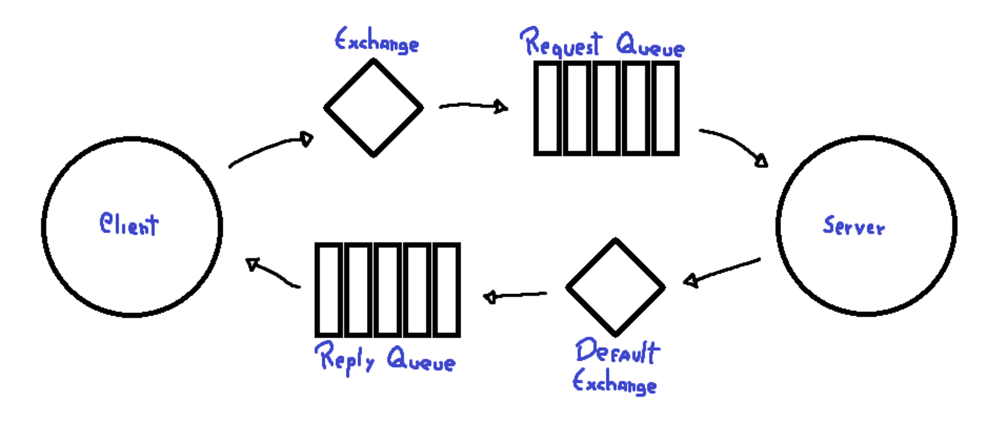

# Padrão de Comunicação Cliente-Servidor

Neste padrão, o cliente envia uma requisição ao servidor, que a processa e responde com uma resposta.

Na imagem acima, observa-se que o cliente envia sua requisição para uma Exchange, que não é padrão. Esta Exchange é responsável por encaminhar a mensagem para uma fila, que por fim a entrega ao servidor. Quando a mensagem chega ao servidor, ele a processa e envia sua resposta para outra Exchange, geralmente a Default Exchange. Posteriormente, a resposta é entregue a uma fila que a encaminhará de volta ao cliente.

**Gerenciamento de Filas de Resposta**

Como o servidor determina em qual fila de resposta colocar sua resposta caso existam várias?

Uma solução para este problema envolve o cliente especificando a fila para a qual a resposta deve ser enviada. Isso pode ser realizado através da propriedade "reply_to". Por exemplo: `reply_to = Fila de Resposta`. Desta forma, a resposta da requisição será enviada para a Fila de Resposta especificada.

**Identificação de Requisições e Respostas Assíncronas**

Outro desafio que pode surgir é quando há múltiplas requisições para um ou mais servidores, e eles respondem de forma assíncrona. Nesse caso, como o cliente determina a qual requisição a resposta se refere?

Para resolver este problema, pode-se utilizar o "message_id" ou o "correlation_id". Estes são utilizados da seguinte forma: `message_id=ABCDEF`.